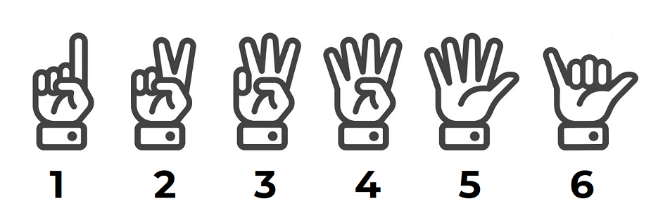

# Hand Cricket
A game that almost every single Indian kid has played in school. Recess, long bus rides and boring English classes, this simple game was played everywhere to kill time. 

The game is simple. You can score runs between 1 and 6, just as in cricket, and these runs add up. If the random number you choose happens to match the number chosen by your opponent, you are out. Once you are out, the opponent starts "batting" and has their runs added up while you try to match their random choice and get them out. 

Depending on the runs scored by each player, a winner is declared. 

# Setup
1. ```pip install -r requirements.txt```
2. ```python Calibration.py``` To get used to the symbols and runs
3. ```python play.py``` To start the game. 
4. Use the `spacebar` key when ready to start the countdown so that both guesses are made at the same time. 

I promise the computer does not cheat. Depending on your hardware specs, performance may vary. 

# Basic instructions: 
The symbols and the associated runs each one scores are given below. The computer vision model is trained on images where your palm faces you and the back of your hand faces the camera. This provides the highest accuracy. 



As this is purely based on neural networks, I can not guarantee a 100% accuracy. In all cases where the algorithm is not sure about your symbol, it will assume a _dot ball_ or 0 runs.  
